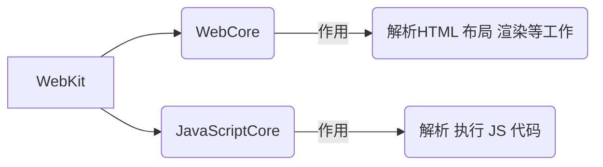
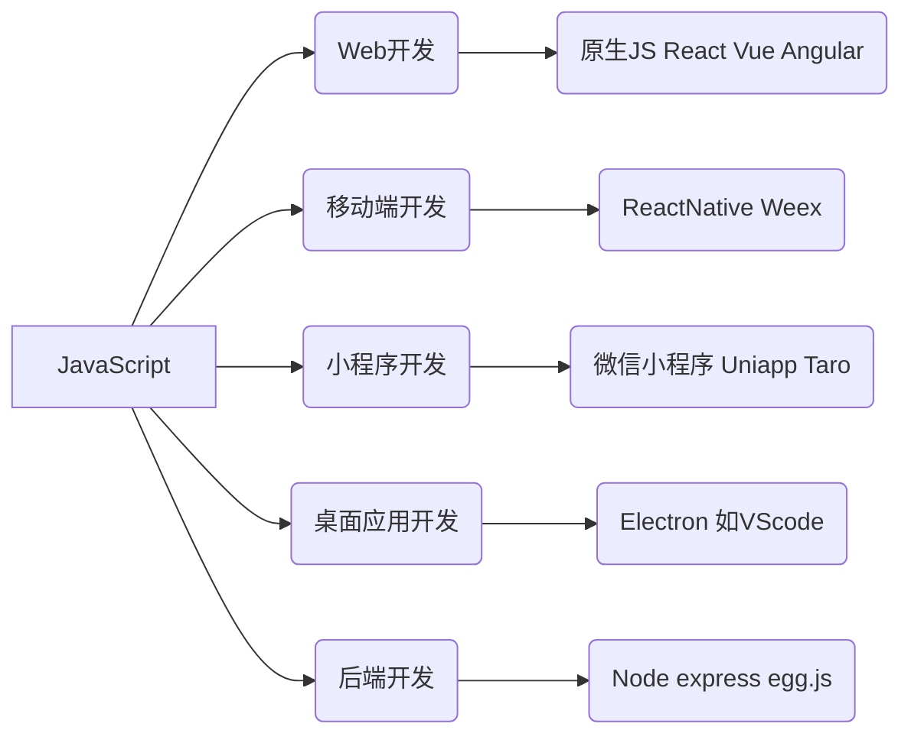

# 一. JavaScript

> JavaScript 是一种具有 **函数优先的轻量级**，**解释性** 或 **即时编译型 ** 的 **编程语言**
>
> 维基百科：
>
> >JavaScript 是一种 **高级的、解释型** 的编程语言
> >
> >JavaScript 是一门基于原型、头部函数的语言，是一门多范式的语言，支持面向对象程序设计，指令式编程，以及函数式编程 

ECMAScript 是一种规范，JavaScript 是这种规范的一种实现


<!-- more -->

[TOC]

## Ⅰ. JavaScript 组成

| ECMAScript   | DOM           | BOM             |
| :----------- | :------------ | --------------- |
| 定义语言规范 | 操作文档的API | 操作浏览器的API |

 

## Ⅱ. JavaScript 引擎

浏览器中的 js 引擎将 JavaScript 代码翻译成 CPU指令来执行

常见的 JavaScript 引擎

| SpiderMonkey   | Chakra                 | JavaScriptCore    | V8                                                |
| -------------- | ---------------------- | ----------------- | ------------------------------------------------- |
| 第一款 js 引擎 | 微软产品，用在IE浏览器 | WebKit中的 js引擎 | Google开发，强大的 js引擎，帮助谷歌浏览器脱颖而出 |


## Ⅲ. 浏览器内核和JS引擎

如： WebKit内核



## Ⅳ. JS 应用

> 任何可以使用 JavaScript 来实现的应用最终都会使用 JavaScript 实现



## Ⅴ. JavaScript 基本语法

### 1.  JS 编写方式

 - **HTML 代码行内**

   ```javascript
   <a href="javascript:alert('点击')" onclick="alert('点击一下')">点击一下</a>
   ```

 - **script 标签中**

   ```javascript
   <a class="test" href="#">百度一下</a>
   <script>
   	const test = document.querySelector(".test")
   	test.onclic = function(){
       alert("百度一下")
     }
   </script>
   ```

- **外部 script 文件**

  ```javascript
  // test.html  中引入 test.js 文件
  <script src="./test.js"></script>  
  
  // test.js
  const test = document.querySelector(".test")
  test.onclic = function(){
    alert("百度一下")
  }
  ```

### 2. \<noscript> 元素
		> 当浏览器不支持脚本、对脚本的支持关闭时，浏览器页面上会显示包含在 \<noscript> 中的内容

```html
<body>
	<noscript>
		<p>你的浏览器不支持或不允许网站使用 JavaScript </p>
	</noscript>
<body>
```

### 3. JS 编写注意事项

- script 不能写成单标签

  <font color=red>~~<script src="index.js" />~~</font>

 - 可以不写 type 属性

   ```javascript
   <script type="text/javascript"></script>
   
   // 现在可以不写 type 属性，因为 JavaScript 是所有现在浏览器以及 HTML5 中的默认脚本语言
   ```

 - 加载顺序

    -  默认遵 HTML 文档加载顺序， 自上而下的加载顺序
    -  建议将 JavaScript 代码放在 body 子元素的最后一行

 - JavaScript 代码严格区分大小写

   	-  HTML 和 CSS属性不区分大小写，但 JavaScript 严格区分大小写


